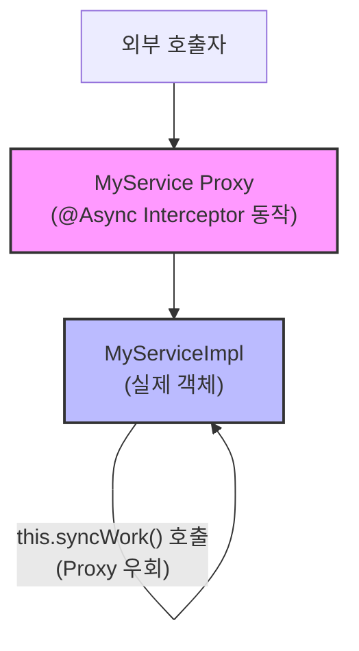
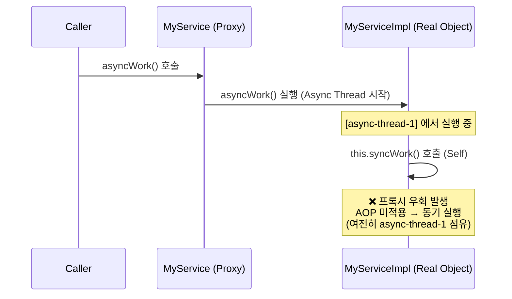
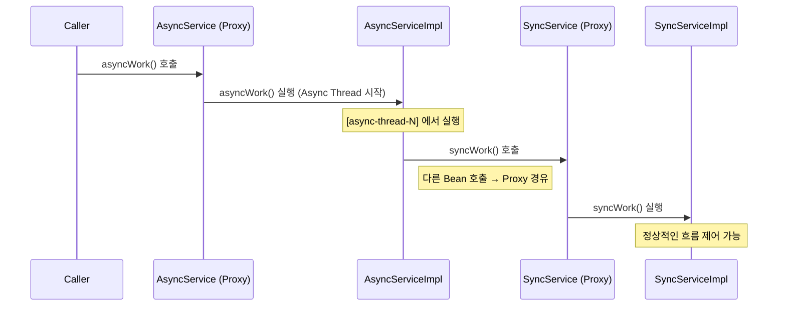
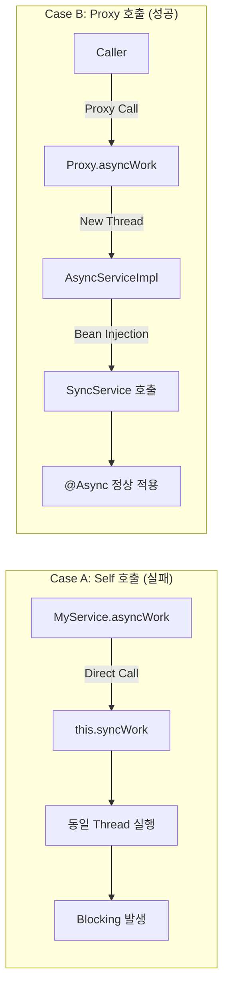

# Spring @Async Self-Invocation 문제 증명 및 분석 보고서

## 1\. 개요 (Overview)

Spring Framework의 `@Async` 애노테이션을 사용할 때, **동일한 클래스 내부에서 메서드를 호출(Self-Invocation)** 하는 경우 비동기 처리가 적용되지 않고 **동기(Synchronous)** 로 실행되는 현상이 발생합니다.

본 문서는 이 현상이 발생하는 원인인 **Spring AOP Proxy 메커니즘**을 분석하고, 실제 코드를 통해 비동기 적용 실패를 증명하며, 올바른 해결 방안을 제시합니다.

-----

## 2\. 핵심 원리: 왜 적용되지 않는가?

### 2.1 Spring AOP와 프록시(Proxy)

Spring의 `@Async`는 AOP(Aspect Oriented Programming)를 기반으로 동작하며, 이는 **프록시 패턴**을 통해 구현됩니다.

1.  외부에서 메서드를 호출하면 **프록시 객체(Proxy Object)** 가 요청을 가로챕니다.
2.  프록시는 별도의 스레드를 생성하거나 스레드 풀에 작업을 위임합니다.
3.  그 후 실제 객체(Target Object)의 메서드를 실행합니다.

### 2.2 Self-Invocation의 문제

하지만 **객체 내부에서 자신의 메서드를 호출(`this.method()`)** 할 때는 프록시를 거치지 않고 **직접(Direct)** 호출하게 됩니다. 따라서 AOP 인터셉터가 동작하지 않아 `@Async` 기능이 무시됩니다.



-----

## 3\. 동작 시나리오 비교

### 3.1 [비정상] Self 호출 시 (실패 사례)

프록시를 통과하여 들어온 요청이 내부에서 `this.syncWork()`를 호출할 때, 이미 할당된 스레드를 그대로 사용하여 동기적으로 실행됩니다.



### 3.2 [정상] Bean 분리 호출 시 (성공 사례)

비동기 메서드와 동기 메서드를 서로 다른 Bean으로 분리하면, 호출 시 다시 프록시를 경유하므로 정상적으로 동작합니다.



-----

## 4\. 상세 증명 방법

이 문제가 발생했음을 확인하는 3가지 기술적 증명 방법입니다.

### 증명 1: Thread Name 비교 (가장 확실한 방법)

`@Async`가 정상 동작한다면 `asyncWork`와 `syncWork`의 스레드 이름이 달라야 합니다. 같다는 것은 동기 실행을 의미합니다.

* **코드 예시:**
  ```java
  @Async
  public void asyncWork() {
      log.info("[async] thread = {}", Thread.currentThread().getName());
      syncWork(); // self 호출
  }

  public void syncWork() {
      log.info("[sync] thread = {}", Thread.currentThread().getName());
  }
  ```
* **실행 결과:**
  ```text
  [async] thread = async-thread-1
  [sync]  thread = async-thread-1   <-- 동일 스레드 (Fail)
  ```

### 증명 2: StackTrace 확인

`syncWork()` 내부에서 스택 트레이스를 찍어보면 프록시 객체가 중간에 개입했는지 확인할 수 있습니다.

* **결과 분석:**
  ```text
  kyy.SampleServiceImpl.syncWork()
  kyy.SampleServiceImpl.asyncWork()  <-- 바로 위에서 호출됨 (Direct Call)
  ...
  Thread.run()
  ```
    * `asyncWork`와 `syncWork` 사이에 `CGLIB`나 `Proxy` 관련 클래스가 없다면 직접 호출된 것입니다.

### 증명 3: 실행 시간 측정 (Blocking 확인)

비동기라면 `asyncWork` 호출 즉시 제어권이 반환되어야 하지만, Self 호출 시 `syncWork`가 끝날 때까지 블로킹됩니다.

* **테스트 시나리오:**
    1.  `asyncWork` 시작
    2.  `syncWork` (2초 대기)
    3.  `asyncWork` 종료
* **결과:** 총 실행 시간이 2초가 걸린다면 동기 실행된 것입니다. (정상 비동기라면 0초에 가까워야 함)

-----

## 5\. 운영상 발생하는 문제점

이 현상을 방치할 경우 운영 환경에서 심각한 리소스 문제를 야기할 수 있습니다.

1.  **Thread Blocking:** 비동기라고 생각했던 로직이 동기로 돌면서 호출자(Caller) 스레드를 점유합니다.
2.  **Thread Pool 고갈:** Async 전용 스레드 풀 내부에서 Blocking I/O가 발생하면, 정작 다른 비동기 작업을 처리할 스레드가 부족해집니다.
3.  **시스템 장애:** 결과적으로 전체 비동기 기능이 마비되거나 응답 지연이 발생합니다.

-----

## 6\. 해결 방안 (Solution)

**반드시 기능을 수행하는 메서드를 별도의 Bean으로 분리해야 합니다.**

### 기존 방식 (문제 발생)

```java
// 하나의 Service 안에 혼재
class MyService {
    @Async 
    public void asyncWork() { this.syncWork(); } // 문제 발생
    public void syncWork() { ... }
}
```

### 개선 방식 (Bean 분리)

```java
@Service
class AsyncWorker {
    @Async
    public void doAsyncJob() { ... }
}

@Service
class MainService {
    private final AsyncWorker asyncWorker; // 주입

    public void logic() {
        // 다른 객체의 메서드를 호출하므로 Proxy를 경유함 -> 비동기 정상 동작
        asyncWorker.doAsyncJob();
    }
}
```

-----

## 7\. 요약 (Summary)



* **Self 호출 = 프록시 우회 = Async 미적용**
* Thread 이름이 동일하다는 것이 가장 강력한 증거입니다.
* 해결을 위해서는 **기능(메서드)을 별도의 클래스(Bean)로 분리**하여 주입받아 사용해야 합니다.