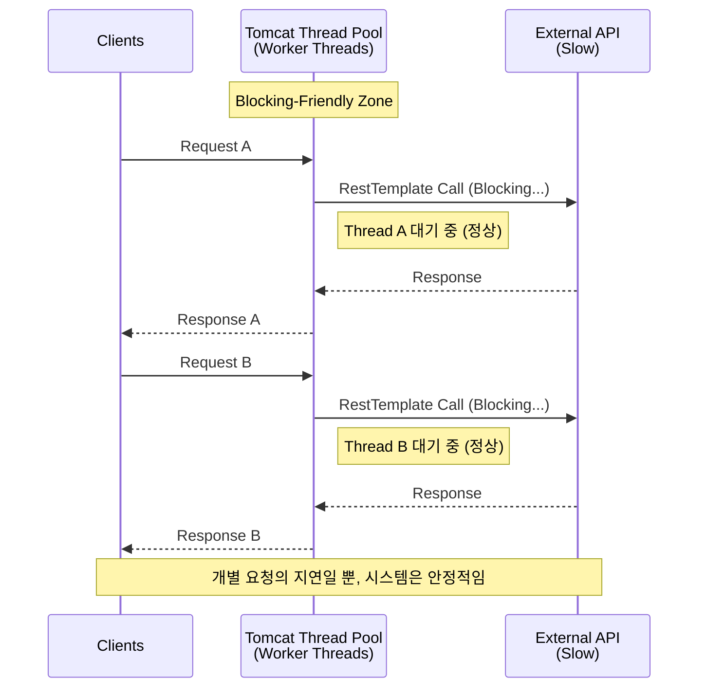
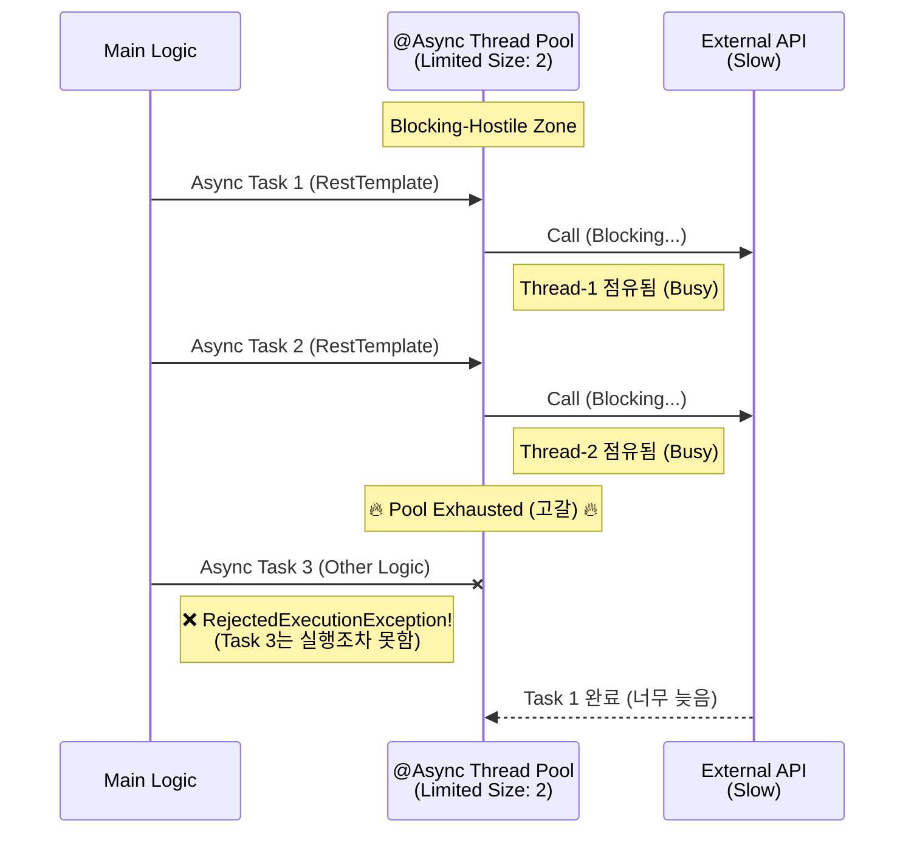

# Blocking I/O(RestTemplate)와 Thread 전략 분석 보고서

## 1\. 개요

Spring 환경에서 `RestTemplate`과 같은 **Blocking I/O** 로직을 수행할 때, 이를 `@Async` (별도 스레드 풀)로 넘기는 것이 오히려 시스템에 치명적인 이유를 분석한다.
결론적으로, Blocking I/O는 **Tomcat Worker Thread**에서 처리하는 것이 구조적으로 옳으며, **Async Thread Pool**에서 처리하는 것은 안티 패턴(Anti-Pattern)이다.

## 2\. RestTemplate의 본질: 완전한 Blocking

`RestTemplate`은 동기(Synchronous) 방식의 클라이언트이다.

```java
RestTemplate.execute()
// 1. Connection Open
// 2. Write Request
// 3. Read Response (대기)
// 4. 완료될 때까지 Thread 점유 (Release 안 됨)
```

* 네트워크 응답이 올 때까지 해당 스레드는 아무것도 하지 못한 채 **완전히 멈춰(Block)** 있는다.

## 3\. Worker Thread와 Async Thread의 역할 차이

### 3.1 Worker Thread (Tomcat Thread)

* **모델:** 요청 1개 = 스레드 1개 (Thread-per-Request)
* **특징:** 클라이언트의 요청부터 응답까지의 생명주기를 담당한다.
* **Blocking 허용:** Worker Thread가 Blocking 되는 것은 자연스러운 현상이다. 이 시간은 단순히 클라이언트 입장에서의 **Latency(지연 시간)** 로 잡힐 뿐, 시스템 전체의 기능 마비로 이어지지는 않는다.
    * *구조:* `Client → Worker Thread → Blocking Call → Response`

### 3.2 Async Thread (@Async TaskExecutor)

* **모델:** 비동기 병렬 처리를 위한 제한된 자원
* **특징:** 백그라운드 작업, 알림 발송 등 '부가적인' 처리를 병렬로 수행하기 위해 존재한다.
* **Blocking 불가:** 스레드 풀의 크기(Size)가 상대적으로 작고 제한적이다. 여기서 Blocking이 발생하면 풀이 즉시 고갈된다.

## 4\. 왜 @Async에서 RestTemplate을 쓰면 안 되는가?

`@Async` 스레드 풀의 설정이 다음과 같다고 가정하자.

* **Core Pool Size:** 50
* **Queue Capacity:** 100

### 시나리오: Blocking 2초짜리 요청이 200개 들어올 경우

1.  **초기 50개:** 스레드 풀의 스레드를 모두 점유한 채 2초간 멈춤 (Block).
2.  **다음 100개:** 큐(Queue)에 쌓여 대기.
3.  **나머지 50개:** 처리할 스레드도 없고, 큐도 꽉 참.
    * 결과: `RejectedExecutionException` 발생.
4.  **치명적 결과:** 단순히 이 요청만 실패하는 것이 아니라, 해당 스레드 풀을 사용하는 **시스템의 모든 비동기 기능이 마비**된다.

## 5\. 핵심 비교 요약

| 구분 | Tomcat Worker Thread | @Async Thread Pool |
| :--- | :--- | :--- |
| **주 목적** | HTTP 요청/응답 처리 | 백그라운드 병렬 작업 처리 |
| **스레드 점유 성격** | **Blocking-Friendly** (막히는 게 정상) | **Blocking-Hostile** (막히면 안 됨) |
| **Blocking 발생 시** | 해당 요청의 응답이 늦어짐 (Latency 증가) | **스레드 풀 고갈 → 전체 비동기 시스템 다운** |
| **적합한 I/O** | Blocking I/O (RestTemplate, JDBC) | Non-Blocking I/O (WebClient) |

## 6\. 결론 및 증명

### 6.1 현상 분석

테스트 시 `Platform Thread`(@Async)환경에서 `RestTemplate`을 호출했을 때 `RejectedExecutionException`이 발생한 것은, **제한된 스레드 자원이 Blocking으로 인해 모두 소진되었음**을 의미한다. 반면 `Virtual Thread`는 Blocking 비용이 거의 0에 수렴하므로 이 문제에서 자유로웠던 것이다.

### 6.2 최종 가이드라인

1.  **RestTemplate(Blocking I/O)** 은 반드시 **Worker Thread(요청 처리 스레드)** 흐름 안에서 실행한다.
2.  **@Async** 는 CPU 연산 위주의 작업이나, Non-Blocking 로직, 혹은 아주 짧은 I/O에만 사용해야 한다.
3.  비동기 I/O가 필요하다면 `WebClient` 같은 Non-Blocking 클라이언트를 사용하거나, `Virtual Thread` 도입을 고려해야 한다.

-----

## 7\. 구조 다이어그램 (Mermaid)

### 

아래 다이어그램은 Worker Thread 방식과 Async Thread 방식의 결정적인 차이를 보여준다.

### Case 1: 정상 구조 (Worker Thread에서 Blocking)

Worker Thread는 각자 독립적으로 Blocking 되며, 서로에게 영향을 주거나 풀을 고갈시키지 않는다. (Tomcat 스레드가 충분하다는 전제 하에)



### Case 2: 문제 구조 (@Async Pool에서 Blocking)

Async Pool은 공유 자원이다. 앞선 요청들이 스레드를 잡고 놓아주지 않으면(Block), 뒤에 들어오는 중요한 비동기 작업들이 모두 거절(Reject)당한다.

